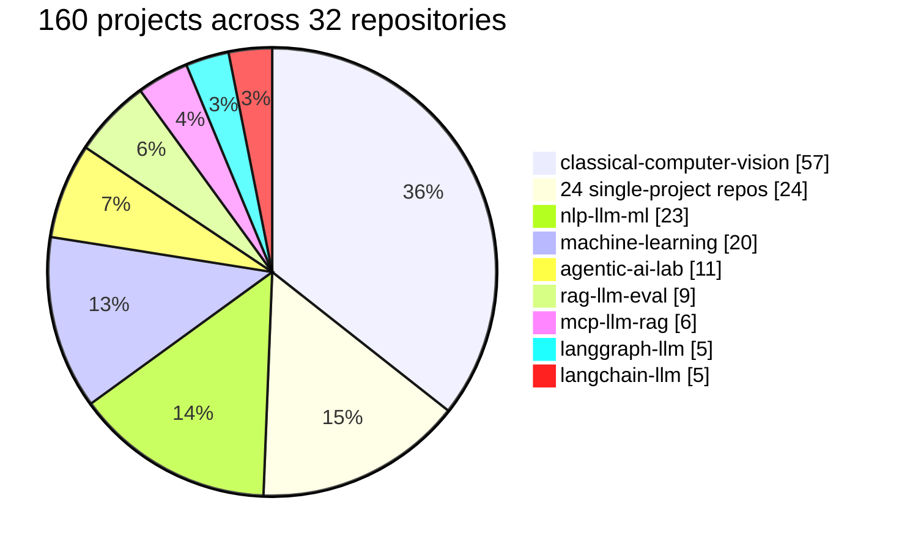

# Muhammad Hammas

**AI Engineer — retrieval, agents, and the parts that have to not break.**

Based in Pakistan. I build systems that are measured rather than demoed: every repository
below states what it does, what it refuses to do, and the numbers behind both.

**32 repositories · 160 projects · 3,480 test functions · every dataset public and cited.**

<b>32 repositories, but 160 projects — eight repos hold more than one</b>

 

| Repository | Projects | What is inside |
|---|---:|---|
| **[classical-computer-vision](https://github.com/hammasbuilds/classical-computer-vision)** | **57** | Classical CV measured against itself — no deep learning, no training, no GPU |
| **[nlp-llm-ml](https://github.com/hammasbuilds/nlp-llm-ml)** | **23** | Classic NLP techniques on one corpus — embeddings, reranking, topic models, tokenisation, Urdu morphology |
| **[machine-learning](https://github.com/hammasbuilds/machine-learning)** | **20** | One per statistical mistake — backtest overfitting, target leakage, overlapping windows, spurious regression, and sixteen more |
| **[agentic-ai-lab](https://github.com/hammasbuilds/agentic-ai-lab)** | **11** | Agent infrastructure tools, each built around something that turned out to be wrong |
| **[rag-llm-eval](https://github.com/hammasbuilds/rag-llm-eval)** | **9** | RAG techniques measured as retrieval, with no language model in the loop |
| **[mcp-llm-rag](https://github.com/hammasbuilds/mcp-llm-rag)** | **6** | MCP red-team, HotpotQA multi-hop RAG, BFCL tool calling, SWE-bench agent, TruthfulQA, FEVER |
| **[langgraph-llm](https://github.com/hammasbuilds/langgraph-llm)** | **5** | Revision loops, router misroute, parallel merge, checkpoint resume, supervisor handoff |
| **[langchain-llm](https://github.com/hammasbuilds/langchain-llm)** | **5** | Structured output, retrieval absences, memory recall, injection defence, judge bias |
| *the other 24 repositories* | **24** | One project each |
| | **160** | |

Eight repositories are **labs** — a set of projects sharing one theme, one environment and one
test suite, because splitting twenty variations on the same idea across twenty repositories
would make each of them look thinner than it is. Everything else is one project per repository.

---

### What I work on

**Retrieval** that cites its sources and declines when the evidence is thin.
**Agents** whose limits are enforced by the runtime rather than requested in a prompt.
**Generative AI** as an engineering problem — fine-tuning, routing, cost, and the evaluation
that tells you whether any of it helped.
**Computer vision**, classical first — knowing what a Sobel filter already solves before
reaching for a network.
**Applied ML and statistics**, where the usual failure is not the model but the question.
**Urdu NLP**, because tooling for 240 million speakers should not have to be rewritten from
scratch by every project that needs it.

---

## Projects

### Retrieval and RAG

| | Stack | The interesting part |
|---|---|---|
| **[rag-forge](https://github.com/hammasbuilds/rag-forge)** | FastAPI · PostgreSQL + pgvector · sentence-transformers · Anthropic API | Every quote is **located in the real source** before it becomes a citation. A quote that cannot be found is dropped, and that drop is a hallucination signal. |
| **[rag-llm-eval](https://github.com/hammasbuilds/rag-llm-eval)** | NumPy · sentence-transformers · HuggingFace Datasets | RAG measured as pure retrieval on 14,602 HotpotQA passages, **no language model in the loop**. Smaller chunks made it worse. Multi-query fusion made it worse. A second retrieval round was worth **+7.1 points** on bridge questions. |
| **[context-bench](https://github.com/hammasbuilds/context-bench)** | Python · NumPy · RAG / CAG / MAG | Where the cost crossover actually sits, and why **prompt caching** — not retrieval quality — is what decides it. |
| **[pak-law-assistant](https://github.com/hammasbuilds/pak-law-assistant)** | Python · BM25 · temporal validity graph | It **will not cite a repealed provision**. Temporal corpus, citation parsing for statutory/subordinate/reported forms, and four explicit refusal conditions. |
| **[deep-research-agent](https://github.com/hammasbuilds/deep-research-agent)** | Python · source dedup · claim verification | Deduplicates republished copies **before** counting corroboration — otherwise one wire story reprinted twelve times reads as twelve sources agreeing. |

### Agents

| | Stack | The interesting part |
|---|---|---|
| **[agentic-ai-lab](https://github.com/hammasbuilds/agentic-ai-lab)** | Python · NiceGUI · marimo · zero runtime dependencies | Eleven agent-infrastructure tools, **zero LLM calls** — mutation testing, AST-verified migration, rollback proving, span-cited contract reading. Each built around something that turned out to be wrong. |
| **[bounded-agent-runtime](https://github.com/hammasbuilds/bounded-agent-runtime)** | FastAPI · Pydantic · Anthropic API · Typer | A chaos suite replaces the agent with something guaranteed to misbehave, then asserts the irreversible action **did not happen** — not that the runtime said it stopped. |
| **[sql-analyst-agent](https://github.com/hammasbuilds/sql-analyst-agent)** | FastAPI · PostgreSQL · SQLGlot · Anthropic API | Three safety layers, and **the prompt is the weakest**. CI attempts five real writes as the agent's role on every push and fails the build if any succeeds. |
| **[enterprise-ops-crew](https://github.com/hammasbuilds/enterprise-ops-crew)** | Python · multi-agent playbooks · approval gates | It stops before anything irreversible. Business-hours SLAs, playbook execution, approval gates, full audit trail. |
| **[mcp-llm-rag](https://github.com/hammasbuilds/mcp-llm-rag)** | MCP · LangChain · Ollama · FastAPI | Six agentic projects on real benchmarks, all local. **Chain-of-thought made every model worse on TruthfulQA** — the 7B lost 35 points. Not one improved. |
| **[langgraph-llm](https://github.com/hammasbuilds/langgraph-llm)** | LangGraph · LangChain · Ollama · Pydantic | Doubling a revision loop from 3 to 6 iterations changed nothing. A confidence gate **dropped clean-ticket accuracy from 100% to 33%**. A silent branch failure was disclosed 0% of the time. |
| **[langchain-llm](https://github.com/hammasbuilds/langchain-llm)** | LangChain · Ollama · Pydantic · httpx | Constrained decoding looked 19 points *less* accurate than plain prompting and is really **3× more** accurate. Retrieval on documents that already fit in context cost 53 points. |

### Generative AI and LLM platform

| | Stack | The interesting part |
|---|---|---|
| **[qlora-finetune-suite](https://github.com/hammasbuilds/qlora-finetune-suite)** | PyTorch · Transformers · PEFT (LoRA) · bitsandbytes | The parts of fine-tuning that go wrong **before** the GPU is touched. Loss masking that stops the model learning to generate prompts, VRAM budgeting, leak-free splits. Runs without a GPU. |
| **[llm-gateway](https://github.com/hammasbuilds/llm-gateway)** | Python · httpx · Anthropic API · model routing | Routing by difficulty, per-tenant budgets, fallback chains, and guardrails that **redact secrets before they leave**. |
| **[llm-observability-platform](https://github.com/hammasbuilds/llm-observability-platform)** | Python · PSI drift detection · cost & latency telemetry | Cost per *success* rather than per call, latency percentiles that exclude cache hits, and prompt drift detected by PSI **without ever storing a prompt**. |
| **[model-serving-platform](https://github.com/hammasbuilds/model-serving-platform)** | Python · A/B + canary + shadow routing · SLO monitor | Auto-rollback that knows the difference between a bad canary and an upstream outage — the distinction that decides whether rolling back helps. |

### Benchmarks and evaluation

Measuring whether a benchmark measures what it claims to. Each of these started as a
question about a widely used evaluation and ended with a number.

| | Stack | The interesting part |
|---|---|---|
| **[swebench-localization](https://github.com/hammasbuilds/swebench-localization)** | Python · pandas · PyArrow · HuggingFace Datasets | **51.3% of instances never name the file you have to fix** — not the path, not the filename, not the module. A single score cannot say which half failed. |
| **[code-eval-harness](https://github.com/hammasbuilds/code-eval-harness)** | Python · pandas · PyArrow · Hugging Face Hub | **Identical outputs score 0% or 94%** depending only on how code is extracted. `prompt+body` — the *original* protocol — scores chat models at zero, silently. |
| **[devign-leakage](https://github.com/hammasbuilds/devign-leakage)** | Python · pandas · PyArrow · Hugging Face Hub | Cross-split leakage is **smaller than assumed** — a negative result, reported. But **every exact duplicate inside the test set carries conflicting labels**. |
| **[docstring-drift](https://github.com/hammasbuilds/docstring-drift)** | Python · stdlib AST · static analysis | **101 across eight major libraries.** The first version reported ~400 in scipy alone and almost none were real; the fixes are in the repo with a regression test each. |
| **[commit-history-forensics](https://github.com/hammasbuilds/commit-history-forensics)** | Python · Git · timestamp forensics | Faking `GIT_COMMITTER_DATE` defeats the timestamp signal — and the forgery is **still caught**, because it edits exactly one file in every commit and real work does not. |

### Computer vision

| | Stack | The interesting part |
|---|---|---|
| **[classical-computer-vision](https://github.com/hammasbuilds/classical-computer-vision)** | OpenCV · scikit-image · NumPy · SciPy | **57 projects, no deep learning, no training, no GPU.** Document scanning, dehazing, low-light enhancement, portrait mode — every finding is a number the code produced, not a claim about what the method should do. |

### Machine learning, NLP and statistics

| | Stack | The interesting part |
|---|---|---|
| **[machine-learning](https://github.com/hammasbuilds/machine-learning)** | scikit-learn · pandas · statsmodels · SciPy | **Twenty** projects, each built around the mistake that makes its answer wrong. 846 trading rules on *shuffled* S&P 500 beat the best rule on the real one. A column of random integers, target-encoded, lifts test AUC from 0.567 to 0.652. |
| **[nlp-llm-ml](https://github.com/hammasbuilds/nlp-llm-ml)** | scikit-learn · sentence-transformers · gensim · NLTK | **Twenty-three** classic NLP techniques measured against each other on the same corpus. BM25 lands within **8 points** of a pretrained neural embedding for **1/270th** of the indexing cost. |
| **[credit-risk-engine](https://github.com/hammasbuilds/credit-risk-engine)** | Python · WoE/IV binning · logistic scorecard | WoE/IV binning with leakage detection, adverse-action reason codes, and a fairness audit reporting **all four incompatible measures** rather than the flattering one. |
| **[demand-forecast-platform](https://github.com/hammasbuilds/demand-forecast-platform)** | Python · hierarchical reconciliation · Croston · ETS | Reconciliation with coherence *asserted*, Croston for intermittent demand, rolling-origin backtest that provably cannot leak. |
| **[insurance-mlops](https://github.com/hammasbuilds/insurance-mlops)** | Python · point-in-time feature store · skew detection | Point-in-time feature leakage, training/serving skew, undocumented models, unlawful data reuse. A release gate that **refuses rather than warns**. |

### Operations and documents

| | Stack | The interesting part |
|---|---|---|
| **[incident-copilot](https://github.com/hammasbuilds/incident-copilot)** | Python · Drain templates · robust z-score (MAD) | Turns forty alarms into one incident with a suspect. The anomaly detector is robust to the outliers it is looking for. |
| **[doc-intelligence-api](https://github.com/hammasbuilds/doc-intelligence-api)** | FastAPI · Pydantic · Jinja2 · confidence routing | Sends a human **one question, not one document**. Cross-field arithmetic validation catches what OCR confidence never will. Pakistani formats: CNIC, NTN, STRN, PK IBAN. |
| **[urdu-nlp-toolkit](https://github.com/hammasbuilds/urdu-nlp-toolkit)** | Python · Unicode normalisation · transliteration | The same Urdu word has several byte encodings that render identically. Without normalising them, every downstream model learns three versions of one word. |

### Computational biology

| | Stack | The interesting part |
|---|---|---|
| **[clcuv-surveillance](https://github.com/hammasbuilds/clcuv-surveillance)** | Python · pairwise alignment · dN/dS · UPGMA phylogeny | Collapsing clonal duplicates turned **9 "emerging variants" into 0**. The signal was the same isolate sequenced repeatedly. |
| **[primer-designer](https://github.com/hammasbuilds/primer-designer)** | Python · nearest-neighbour thermodynamics · conservation analysis | Alerts when a deployed assay starts going blind because a mutation landed at the 3′ end. Nearest-neighbour thermodynamics, degenerate primers. |

---

### What I am building next

Vision and multimodal, with the same rule as everything above — the result is whatever the
code produced.

**Generative vision** — GANs and diffusion, one architecture family per project rather than
five wrappers around the same checkpoint.
**Video understanding** — detection on video rather than on frames pretending to be
independent, temporal action localization, and activity recognition.
**Video segmentation** — frame-based segmentation where the honest question is what breaks
when the object leaves the frame and comes back.
**Concept bottleneck models (CBM)** — where the concept layer is the explanation rather than
a post-hoc story told about a black box.
**Vision-language models (VLM)** — and the evaluation that says whether the caption describes
the image or the training distribution.
**Explainability and captioning** — attribution that is checked against an intervention, not
just rendered as a heatmap.

---

### How I build

**Measured, not claimed.** No number appears in a README until it has been produced on a
machine. Where a result disagreed with what I expected, the README says so — several of
these projects exist because the first answer was wrong.

**Failure is a feature.** A RAG system that cannot say "I don't know" cannot be trusted with
the answers it does give. An agent that cannot be stopped is not autonomous, it is
unsupervised. Refusal rates and containment are scored metrics, not edge cases.

**Enforced, not requested.** Safety that lives in a prompt is a suggestion. It belongs in a
database role, a parse tree, or a budget the agent cannot reach.

**Limits stated plainly.** Every README has a section on what the project does not do. A tool
that overclaims wastes the time of everyone who tries it.

**Wrong answers are reported, not tuned away.** Several of these repositories exist because a
first result was wrong and the investigation was more interesting than the fix — a scanner
whose first run produced 400 false positives, a leakage audit that disproved its own premise,
a test harness that scored working models at zero.

---

### Stack

`Python` · `FastAPI` · `PostgreSQL + pgvector` · `Redis` · `Docker` · `uv` · `PyTorch` ·
`Transformers` / `PEFT` / `bitsandbytes` · `scikit-learn` · `pandas` / `NumPy` / `SciPy` /
`statsmodels` · `sentence-transformers` · `OpenCV` / `scikit-image` ·
`Ollama` / `Claude` / `HuggingFace` behind one interface · `Model Context Protocol` ·
`LangChain` / `LangGraph` · `GitHub Actions`

---

📫 Open to AI/ML engineering roles.
